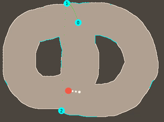
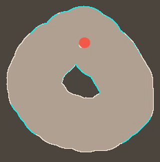
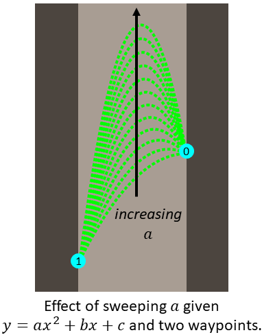
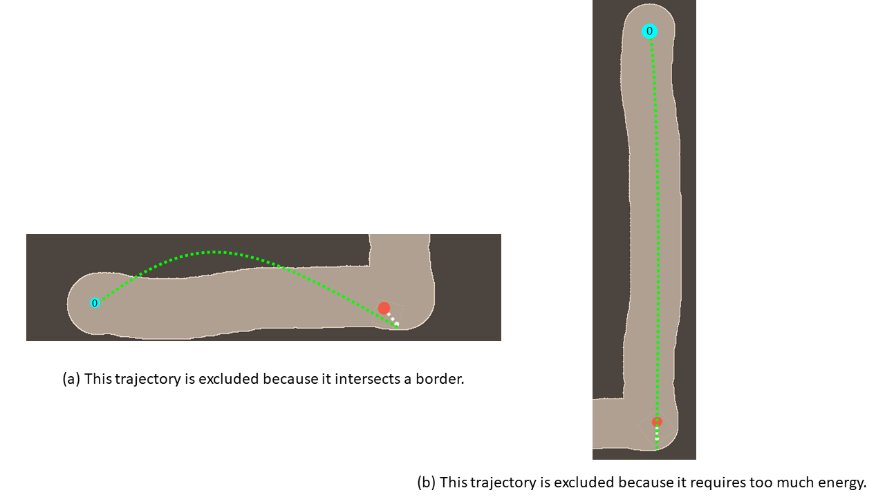
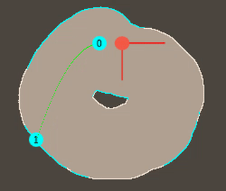
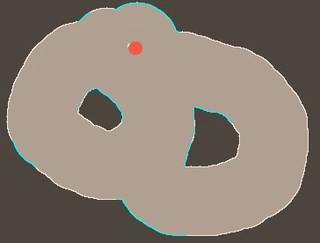
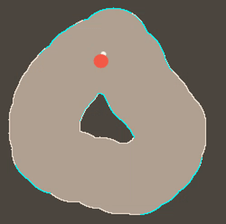

# pogo
an underactuated game


## development snapshots






## Defining the Environment
Our simulation opens on Pogo, a character on a pogo stick bouncing around a world you create. Click and drag through the screen to define an area through which Pogo can travel. When you release the mouse, that point will be defined as the goal to which Pogo must travel. Once Pogo has this goal, it performs trajectory optimization to determine the optimal path from it's current position to the goal. The path is displayed using green dots between cyan waypoints along the walls. Each waypoint is labeled with the number of remaining hops to the goal.

## Dynamics
Specifying stable and sensible contact forces at a constant frame rate
(that is, using explicit numerical integration) proved more of a challenge
than expected, even for such a soft system. Velocity Verlet integration
was used to slightly increase fidelity and reduce some of the energy gain
created by springs slipping through walls. Dynamics of the spring were
prototyped with a controller which angled the spring at the distance-weighted average of all walls within reach; dynamics of the head created a fictitious
spring to every walls within the head's radius, creating the same net effect.

## Trajectory Optimization
On every `mouseup` event, the cursor's position is recorded as the goal position for Pogo to reach. Once the goal is determined, Pogo investigates every point along the border between the light and dark regions in the environment to determine from which border points Pogo can reach the goal in one hop. All one-hop points are stored in an array of reachable border points. For each of these newly reachable points, Pogo repeats the investigation with every remaining "unreached" point. Of these unreached points, those that can reach any of the points that can reach the goal are added to the reachable array. The process repeats until the array of reachable points stabilizes. All remaining points are considered unreachable. The complete algorithms is as follows:
```
1. Acquire goal point from mouseup event.
2. Clear all route information from tree.
3. Initialize cost (hops from goal) at zero.
4. Initialize array of last reached points with goal.
5. Initialize array of unreached points with a clone of the array of border points.
5. While the array of last reached points has nonzero length:
	1. Increment cost by one.
	2. Initialize array of newly reached points with empty array.
	3. For each point in the array of last reached points, p:
		1. For each unreached point that can reach p, q:
			1. Add q to the array of points that can reach p.
			2. Remove q from the array of unreached points.
			3. Add q to the array of reached points.
		2. Reset array of last reached points with the array of newly reached points.
```
By building out the tree in this way, Pogo guarantees that hopping backwards through the tree guarantess they are following an optimal path to the goal.

To determine whether or not one point is reachable from another, Pogo uses the knowledge that, when they are not in contact with the border, they move as a ballistic projectile and thus all paths between waypoints are parabolas. This drastically simplifies Pogo's decision making because, with start and end points defined, Pogo needs only to sweep over one degree of freedom to find a suitable parabola. This one-dimensional search is illustrated below.



Thus, to determine whether one point is reachable by another, Pogo just needs to find a connecting parabola that (a) does not require too much energy and (b) does not intersect another border point. If one such parabola can be found, the points are considered connectable. These exclusion criteria are illustrated below.



The waypoint feasibility algorithm is as follows:
```
1. Calculate minimum a based on minimum amount of energy necessary needed to get to Point B.
2. If Point A is directly below Point B:
	1. If it would require too much energy to jump to Point B:
		1. Return false.
	2. For each point between A and B:
		1. If the point is not traversible (e.g. if it is a border point):
			1. Return false.
3. Else if Point A is directly above Point B:
	1. For each point between A and B:
		1. If the point is not traversible (e.g. if it is a border point):
			1. Return false.
4. Else (i.e. the path is parabolic):
	1. For each a between the minimum (based on geometry) and maximum (based on energy):
		1. Compute b and c as set by Point A, Point B, and a.
		2. For each point along the trajectory y=ax^2+bx+c between Points A and B:
			1. If the point is not traversible (e.g. if it is a border point):
				1. Try next a.
		3. If I made it through the whole trajectory:
			1. Return true.
	2. Was unable to find a path. Return false.
```
where `Point A` is the start point and `Point B` is the end point.

## Trajectory-Optimizing Controller

The trajectory optimizations made several simplifying assumptions about the
physics of the simulation, so the first step towards using them in a controller
was to make those assumptions closer to the truth by removing the spring
and giving the head the impulse necessary to achieve the desired velocity
whenever it made contact with the ground:



Sadly, carrying these assumptions over to the full model remained difficult.
Ultimately what worked best was to iterate over the reachable border looking
for a border pixel that would push pogo in the right direction to achieve
that pixel's desired ballistic trajectory, and then extending the rest length
of the spring (with a velocity limit) to try to push from that pixel:



This controller does not always achieve the appropriate exit velocity
(something a model-predictive controller might fix), nor does it account for
the displacement between the contact point and center of mass:



Despite this the controller does show some limitations of our trajectory
optimization approach; the trajectories produced have a limited total energy,
but do not take into account the momentum with which pogo may have when it
makes contact; the controller can only do so much compensation for this.
Taking such into account would also allow the trajectories to make more use
of pogo's speed, perhaps leading to more of the playful acrobatics seen
in the dummy controller.

## File Descriptions
| File Name | Description |
| --------- | ----------- |
| colorCanvas.js | Draws the base colors on the canvas. |
| containsPoint.js | Determines whether an array contains a specific point. |
| drawFrame.js | Callback used by requestAnimationFrame. |
| drawPogo.js | Draws the Pogo character on the canvas. |
| findRoute.js | Performs path planning through the borderPixel tree. |
| getMousePos.js | The position of the cursor. |
| getPixelsThatCanReach.js | Finds all the points capable of reaching a specified point. |
| hex2rgb.js | Converts hexadecimal color string to RGB array. |
| index.html | HTML home page of the Pogo game. Assembles JavaScript files. |
| labelGoodRegion.js | Updates the mask when the mouse is clicked. |
| main.js | Parent JavaScript code that declares constants and listeners and initializes global variables. |
| Point.js | Class for border points. |
