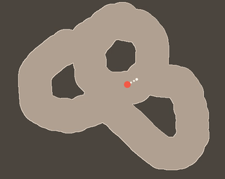

# pogo
an underactuated game

## Defining the Environment
Our simulation opens on Pogo, a character on a pogo stick bouncing around a world you create. Click and drag through the screen to define an area through which Pogo can travel. When you release the mouse, that point will be defined as the goal to which Pogo must travel. Once Pogo has this goal, it performs trajectory optimization to determine the optimal path from it's current position to the goal. The path is displayed using green dots between cyan waypoints along the walls. Each waypoint is labelled with the number of remaining hops to the goal.

## Trajectory Optimization
On every `mouseup` event, the cursor's position is recorded as the goal position for Pogo to reach. Once the goal is determined, Pogo investigates every point along the border between the light and dark regions in the environment to determine from which border points Pogo can reach the goal in one hop. All one-hop points are stored in an array of reachable border points. For each of these newly reachable points, Pogo repeats the investigation with every remaining point