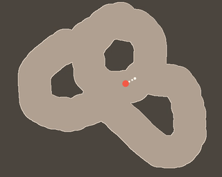

# pogo
an underactuated game



## Defining the Environment
Our simulation opens on Pogo, a character on a pogo stick bouncing around a world you create. Click and drag through the screen to define an area through which Pogo can travel. When you release the mouse, that point will be defined as the goal to which Pogo must travel. Once Pogo has this goal, it performs trajectory optimization to determine the optimal path from it's current position to the goal. The path is displayed using green dots between cyan waypoints along the walls. Each waypoint is labelled with the number of remaining hops to the goal.

## Trajectory Optimization
On every `mouseup` event, the cursor's position is recorded as the goal position for Pogo to reach. Once the goal is determined, Pogo investigates every point along the border between the light and dark regions in the environment to determine from which border points Pogo can reach the goal in one hop. All one-hop points are stored in an array of reachable border points. For each of these newly reachable points, Pogo repeats the investigation with every remaining "unreached" point. Of these unreached points, those that can reach any of the points that can reach the goal are added to the reachable array. The process repeats until the array of reachable points stabilizes. All remaining points are considered unreachable. The complete algorithms is as follows:
```
1. Acquire goal point from mouseup event.
2. Clear all route information from tree.
3. Initialize cost (hops from goal) at zero.
4. Initialize array of last reached points with goal.
5. Initialize array of unreached points with a clone of the array of border points.
5. While the array of last reached points has nonzero length:
	1. Increment cost by one.
	2. Initialize array of newly reached points with empty array.
	3. For each point in the array of last reached points, p:
		1. For each unreached point that can reach p, q:
			1. Add q to the array of points that can reach p.
			2. Remove q from the array of unreached points.
			3. Add q to the array of reached points.
		2. Reset array of last reached points with the array of newly reached points.
```
By building out the tree in this way, Pogo guarantees that hopping backwards through the tree guarantess they are following an optimal path to the goal.

To determine whether or not one point is reachable from another, Pogo uses the knowledge that, when they are not in contact with the border, they move as a ballistic projectile and thus all paths between waypoints are parabolas. This drastically simplifies Pogo's decision making because, with start and end points defined, Pogo needs only to sweep over one degree of freedom to find a suitable parabola. This one-dimensional search is illustrated below.

IMAGE WILL GO HERE

Thus, to determine whether one point is reachable by another, Pogo just needs to find a connecting parabola that (a) does not require too much energy and (b) does not intersect another border point. If one such parabola can be found, the points are considered connectable. These exclusion criteria are illustrated below.

IMAGE WILL GO HERE